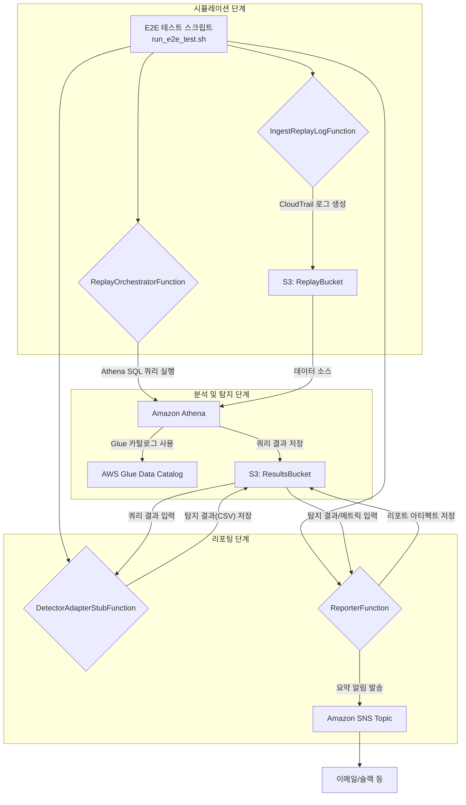

# Incident Replay Simulator

CloudTrail 로그/이벤트를 기반으로 특정 공격 시나리오를 재현하고, 그 결과를 분석하여 탐지 정확도를 측정하는 워크플로입니다.

## 목차

* [프로젝트 소개 (Overview)](#프로젝트-소개-overview)
* [빠른 시작 (Quick Start)](#빠른-시작-quick-start)
* [설정/구성 (Configuration)](#설정구성-configuration)
* [아키텍처 개요 (Architecture)](#아키텍처-개요-architecture)
* [운영 방법 (Operations)](#운영-방법-operations)
* [보안 & 컴플라이언스 (Security & Compliance)](#보안--컴플라이언스-security--compliance)
* [기여 가이드 (Contribution Guide)](#기여-가이드-contribution-guide)
* [라이선스 (License)](#라이선스-license)
* [변경 이력 (Changelog)](#변경-이력-changelog)

---

## 프로젝트 소개 (Overview)

본 프로젝트는 실제 발생 가능한 클라우드 보안 인시던트를 시뮬레이션하고, 이를 기반으로 보안 탐지 시스템의 유효성을 검증하기 위해 설계되었습니다. 초기 버전은 **비정상적인 IAM 사용자 생성 및 권한 상승** 시나리오에 초점을 맞추고 있습니다.

**주요 기능**

* **시나리오 기반 이벤트 생성**: 특정 공격 시나리오(예: IAM 사용자 생성 → 권한 부여 → Access Key 생성)에 맞는 CloudTrail 로그를 동적으로 생성하여 S3에 저장
* **Athena/Glue 기반 분석**: S3에 저장된 로그를 AWS Glue 데이터 카탈로그와 Amazon Athena로 SQL 분석, 이상 행위 시퀀스 탐지
* **탐지 결과 리포팅 및 알림**: Precision/Recall/F1-Score 계산 및 요약을 Amazon SNS로 발송
* **안전한 배포 워크플로**: AWS SAM 기반 배포, `DeletionPolicy: Retain` 및 조건부 리소스 생성으로 운영 데이터 보호

---

## 빠른 시작 (Quick Start)

### 사전 준비 (Prerequisites)

* Python 3.11+
* AWS CLI (인증 정보 구성 완료)
* AWS SAM CLI
* `jq` (E2E 테스트 스크립트 실행 시 필요)

### 로컬 설정 (Local Setup)

```bash
# 1) 가상 환경 생성 및 활성화
python -m venv .venv
source .venv/bin/activate    # Windows: .venv\Scripts\activate

# 2) 의존성 설치
pip install -r requirements.txt

# 3) .env 파일 설정 (필요 시)
# .env.example을 복사해 .env 생성 후 필요한 값만 수정
cp .env.example .env
# ※ SAM 배포 시 파라미터로 주입하므로, .env는 로컬 테스트 시에만 필요
```

### 최소 실행 경로 (Minimal Execution Path)

* **Unit Tests**

```bash
pytest
```

* **Lint & Type Check (권장)**

```bash
# ruff check .
# mypy .
```

* **Local Invoke (개별 함수 테스트 — 배포 전)**

```bash
sam build
sam local invoke IngestReplayLogFunction --event events/ingest.json
```

---

## AWS 배포 (Deployment)

```bash
# 1) 애플리케이션 빌드
sam build

# 2) 최초 배포 (guided)
sam deploy --guided
```

> ⚠️ **중요**
> `sam deploy --guided` 실행 시, **Stack Name**은 소문자/숫자/하이픈(-)만 사용하세요.
> **ReplayBucketName**과 **ResultsBucketName** 파라미터는 *비워두어* CloudFormation이 **고유 버킷 이름을 자동 생성**하도록 강력 권장합니다.
> **Disable rollback** 프롬프트에는 `n`을 입력해 롤백을 활성화하세요.
> 최초 배포 이후에는 `samconfig.toml`이 생성되므로 이후에는 `sam deploy`만으로 배포 가능.

---

## End-to-End 테스트 (E2E Test)

배포 완료 후 전체 워크플로 동작을 검증합니다.

```bash
# 실행 권한 부여
chmod +x run_e2e_test.sh

# E2E 테스트 실행
./run_e2e_test.sh
```

해당 스크립트는 배포된 Lambda들을 순차 호출하고, 최종 결과물이 S3에 정상 생성되었는지 검증합니다.

---

## 설정/구성 (Configuration)

### 환경 변수

본 프로젝트의 Lambda 함수들은 SAM 템플릿(`template.yaml`)의 **Globals** 섹션을 통해 환경 변수를 주입받습니다.

> 아래 표의 변수명/예시는 콘솔 폭 제한으로 일부가 생략(`...`)되어 있으며, 실제 값은 템플릿/스택 출력에 따릅니다.

| 환경 변수 (예시)   | 설명                         | 예시 값                              | 보안 주의사항                    |
| ------------ | -------------------------- | --------------------------------- | -------------------------- |
| `BUCKET_...` | 재현용 CloudTrail 로그 저장 S3 버킷 | `incident-replay-simulator-re...` | 민감 데이터 포함 가능. 접근 제어/암호화 필수 |
| `ATHENA_...` | Athena 쿼리 결과/분석 리포트 저장 버킷  | `incident-replay-simulator-re...` | 분석 결과 포함. 접근 최소화           |
| `GLUE_DA...` | Athena에 사용될 Glue 데이터베이스 이름 | `irsdb-123456789012-ap-northe...` | -                          |
| `ATHENA_...` | 사용할 Athena 작업 그룹           | `irswg-123456789012-ap-northe...` | -                          |
| `NOTIFIC...` | 분석 결과 알림용 SNS 토픽 ARN       | `arn:aws:sns:ap-northeast-2:1...` | 구독자 관리 주의                  |

### IAM 최소 권한 (Least Privilege)

`template.yaml`에 정의된 각 Lambda는 최소 권한으로 동작합니다.

* **IngestReplayLogFunction**: ReplayBucket에 대한 `s3:PutObject`
* **ReplayOrchestratorFunction**:

  * AthenaWorkGroup에 대한 `athena:StartQueryExecution` 등 쿼리 실행
  * ResultsBucket에 대한 `s3:GetObject`, `s3:PutObject`
  * GlueDatabase에 대한 `glue:GetTable` 등 메타데이터 접근
* **DetectorAdapterStubFunction**: ResultsBucket 쿼리 결과에 대한 `s3:GetObject`
* **ReporterFunction**:

  * ResultsBucket 메트릭 파일 `s3:GetObject` 및 아티팩트 저장 `s3:PutObject`
  * NotificationSnsTopic에 대한 `sns:Publish`

> 🔐 **원칙**: 모든 IAM 권한은 **리소스 수준**(특정 S3 버킷/경로, 특정 Athena 작업 그룹)으로 범위를 좁히고, 필요한 경우 `aws:ResourceAccount` 등 **조건 키**를 활용하여 최소 권한을 준수합니다.

### 암호화 (Encryption)

* **S3 버킷**: 기본 **SSE-S3 (AES256)** 활성화. 더 강력한 통제 필요 시 **SSE-KMS** 권장
* **Athena 작업 그룹**: 쿼리 결과 암호화 필요. 템플릿 기본값은 **SSE_S3**
* ⚠️ **SSE-KMS 사용 시**: S3 버킷 정책이 KMS를 강제한다면 **Athena 결과 암호화도 SSE_KMS**로 지정해야 하며, 해당 **KMS 키 정책**의 Key Users에 **Lambda 실행 역할**과 **Athena 사용 주체**를 추가해야 합니다. 미설정 시 결과 쓰기 실패 발생

---

## 아키텍처 개요 (Architecture)

### 워크플로 다이어그램



### 의존 서비스

* AWS Lambda
* Amazon S3
* AWS Glue Data Catalog
* Amazon Athena
* Amazon SNS
* Amazon CloudWatch Logs

### 데이터 흐름 및 보존

1. **Ingest**: 재현용 CloudTrail 로그가 ReplayBucket에 저장
2. **Orchestrate**: Athena가 ReplayBucket 로그를 쿼리, 결과를 ResultsBucket에 CSV로 저장
3. **Detect & Report**: 후속 함수가 ResultsBucket 데이터를 읽어 탐지율 계산, 최종 리포트를 `artifacts/` 경로에 저장
4. **보존**: ResultsBucket은 **Lifecycle Rule(30일 후 자동 삭제)**, ReplayBucket/ResultsBucket은 **DeletionPolicy: Retain**으로 스택 삭제 시에도 데이터 보존

---

## 운영 방법 (Operations)

### 헬스체크 및 모니터링

* **로그 위치**: CloudWatch Logs — `/aws/lambda/<스택이름>-<함수논리ID>-<해시>`
* **주요 에러 패턴**

  * `Runtime.ImportModuleError`: 배포 패키지 누락/경로 오류 → `sam build` 재실행, `template.yaml`의 `CodeUri`/`Handler` 확인
  * `ValueError: ... environment variable is not set`: 환경 변수 미주입 → `Globals`/개별 함수 `Environment` 확인
  * `AccessDeniedException`: S3/Glue/Athena/KMS 권한 부족 → `template.yaml`의 `Policies` 재점검

### 자주 발생하는 장애 및 복구 절차

**1) "Resource already exists" (CFN 배포 실패)**

* **요약**: 이전 실패로 리소스가 잔존한 상태에서 동일 이름으로 재생성 시 충돌
* **체크리스트**

  1. CFN 콘솔 **Events** 탭에서 충돌 리소스 확인
  2. 해당 리소스(S3 버킷, Glue DB 등)를 콘솔/CLI로 수동 삭제
  3. ⚠️ **S3는 비우기 선행**. 버전관리 활성화 시 **모든 버전 삭제** 필요 (`clear_bucket.py` 사용 권장)
* **복구**

  1. `aws cloudformation delete-stack --stack-name <스택이름>`
  2. `sam deploy` 재실행

**2) "Athena query failed: ... AccessDeniedException"**

* **요약**: Athena 또는 Lambda 역할이 S3/KMS 접근 권한 부족
* **체크리스트**

  1. Athena **OutputLocation**이 올바른지 확인
  2. Lambda 역할에 S3 `s3:GetObject`, `s3:ListBucket` 권한 포함 여부 확인
  3. 데이터가 **SSE-KMS**인 경우, Lambda 역할과 Athena 사용 주체가 **KMS Key Users**에 포함되어 있는지 확인

---

## 보안 & 컴플라이언스 (Security & Compliance)

* **비밀값 관리**: API 키/Access Key 등 비밀은 **코드/README에 하드코딩 금지**. 로컬은 `.env`(예: `.env.example` 템플릿), 운영은 **AWS Secrets Manager/Parameter Store** 활용
* **데이터 분류 및 보존**

  * **분류**: CloudTrail 로그/분석 결과는 "내부(Internal)" 또는 "기밀(Confidential)"로 분류될 수 있음. 조직 정책 준수
  * **보존**: ResultsBucket 기본 **30일 보존 후 삭제**(Lifecycle). 컴플라이언스 요구에 맞게 `template.yaml`에서 조정
* **최소 권한 원칙 (Least Privilege)**

  * 모든 IAM 역할은 **필요 최소 리소스/작업**만 접근
  * **참고 표준**: *NIST SP 800-53 Rev.5 AC-6 (Least Privilege)*, *ISO/IEC 27001:2022 Annex A A.5.15 (Access Control)*
* **취약점 신고**: 취약점 발견 시 GitHub 이슈 생성 또는 관리자에게 직접 연락 (향후 `SECURITY.md` 추가 예정)

---

## 기여 가이드 (Contribution Guide)

* **브랜치 전략**: `main` 보호. 모든 변경은 `feature/<기능>` 또는 `bugfix/<이슈>` 브랜치에서 작업 후 PR로 병합
* **커밋 규칙**: [Conventional Commits](https://www.conventionalcommits.org/) 권장 (예: `feat:`, `fix:`, `docs:`, `test:`)
* **코드 스타일 및 품질**

  * `pytest`로 테스트 실행

  ```bash
  pip install -r requirements.txt
  pytest
  ```

  * 모든 신규 기능/버그 수정에는 **관련 테스트 코드 필수**
* **PR/이슈 템플릿**: 추가 예정

---

## 라이선스 (License)

TBD (추후 지정 예정)

---

## 변경 이력 (Changelog)

모든 릴리스 정보는 **GitHub Releases** 페이지에서 확인할 수 있습니다:
[https://github.com/jijae92/IncidentReplaySimulator/releases](https://github.com/jijae92/IncidentReplaySimulator/releases)
